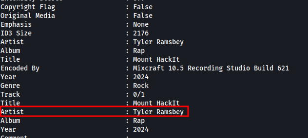

## Learning Objectives

- Learn how to investigate malicious link files.
- Learn about OPSEC and OPSEC mistakes.
- Understand how to track and attribute digital identities in cyber investigations.

### Youtube to MP3 Converter Websites

These websites have been around for a long time. They offer a convenient way to extract audio from YouTube videos, making them popular. However, historically, these websites have been observed to have significant risks, such as:

- Malvertising: Many sites contain malicious ads that can exploit vulnerabilities in a user's system, which could lead to infection.
- Phishing scams: Users can be tricked into providing personal or sensitive information via fake surveys or offers.
- Bundled malware: Some converters may come with malware, tricking users into unknowingly running it.

#### Getting Some Tunes

Let's find out by pasting any YouTube link in the search form and pressing the "Convert" button. Then select either mp3 or mp4 option. This should download a file that we could use to investigate. For example, we can use https://www.youtube.com/watch?v=dQw4w9WgXcQ, a classic if you ask me.

Once downloaded, navigate to your Downloads folder or if you are using the AttackBox, to your /root/ directory. Locate the file named download.zip, right-click on it, and select Extract To. In the dialog window, click the Extract button to complete the extraction.

### Searching the Source

There are many paths we could take to continue our investigation. We could investigate the website further, analyse its source code, or search for open directories that might reveal more information about the malicious actor's setup. We can search for the hash or signature on public malware databases like VirusTotal or Any.Run. Each of these methods could yield useful clues.

However, for this room, we'll try something a bit different. Since we already have the PowerShell code, searching for it online might give us useful leads. It's a long shot, but we'll explore it in this exercise.

There are many places where we can search for code. The most widely used is Github. So let's try searching there.

To search effectively, we can look for unique parts of the code that we could use to search with. The more distinctive, the better. For this scenario, we have the string we've uncovered before that reads:

"Created by the one and only M.M."

Search for this on Github.com or by going directly to this link: https://github.com/search?q=%22Created+by+the+one+and+only+M.M.%22&type=issues

### Introduction to OPSEC

This is a classic case of OPSEC failure.

Operational Security (OPSEC) is a term originally coined in the military to refer to the process of protecting sensitive information and operations from adversaries. The goal is to identify and eliminate potential vulnerabilities before the attacker can learn their identity.

In the context of cyber security, when malicious actors fail to follow proper OPSEC practices, they might leave digital traces that can be pieced together to reveal their identity. Some common OPSEC mistakes include:

- Reusing usernames, email addresses, or account handles across multiple platforms. One might assume that anyone trying to cover their tracks would remove such obvious and incriminating information, but sometimes, it's due to vanity or simply forgetfulness.
- Using identifiable metadata in code, documents, or images, which may reveal personal information like device names, GPS coordinates, or timestamps.
- Posting publicly on forums or GitHub (Like in this current scenario) with details that tie back to their real identity or reveal their location or habits.
- Failing to use a VPN or proxy while conducting malicious activities allows law enforcement to track their real IP address.

## Answer the questions below

1. Looks like the song.mp3 file is not what we expected! Run "exiftool song.mp3" in your terminal to find out the author of the song. Who is the author? 

R: Tyler Ramsbey

``exiftool -u -a song.mp3``

2. The malicious PowerShell script sends stolen info to a C2 server. What is the URL of this C2 server?

R: http://papash3ll.thm/data

3. Who is M.M? Maybe his Github profile page would provide clues?

R: Mayor Malware

4. What is the number of commits on the GitHub repo where the issue was raised?

R: 1
