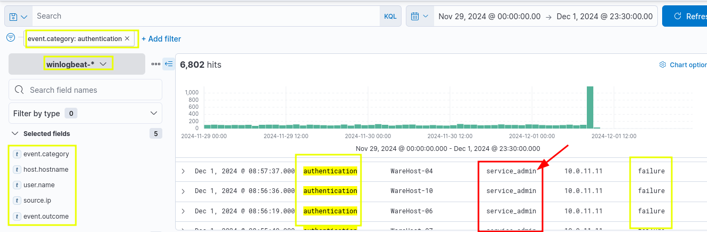
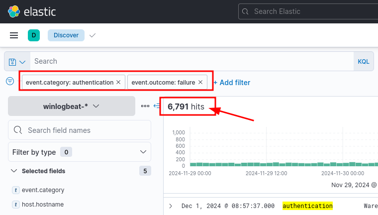
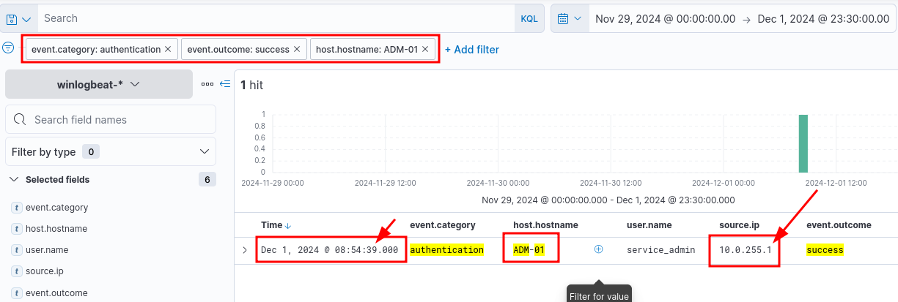
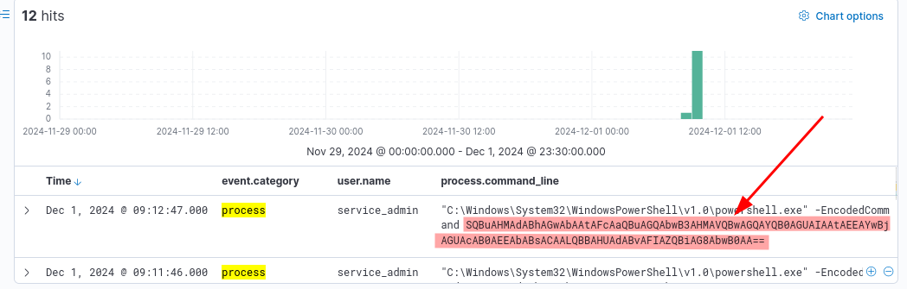

## Is this a TP or an FP?

Similar to every SOC, the analysts in the Wareville SOC also need to differentiate TPs from FPs. This becomes especially difficult for them near Christmas when the analysts face alert fatigue. High chances of misclassification of TPs into FPs and vice versa are present in such times. The analysts, therefore, appreciate any help they could get from us in this crucial time. To make matters worse, the office of the Mayor has sent the analysts an alert informing them of multiple encoded powershell commands run on their systems. Perhaps we can help with that.

## Context

While it might seem like using the SOC superpower makes things super easy, that is not always the case. There are cases which can act as Kryptonite to the SOC superpower:

- If an organisation doesn't have a change request process in place.
- The performed activity was outside the scope of the change request or was different from that of the approved change request.
- The activity triggered an alert, such as copying files to a certain location, uploading a file to some website, or a failed login to a system. 
- An insider threat performed an activity they are not authorised to perform, whether intentionally or unintentionally.
- A user performed a malicious activity via social engineering from a threat actor.

## Correlation

When building the context, the analyst must correlate different events to make a story or a timeline. Correlation entails using the past and future events to recreate a timeline of events. When performing correlation, it is important to note down certain important artefacts that can then be used to connect the dots. These important artefacts can include IP addresses, machine names, user names, hashes, file paths, etc.

Correlation requires a lot of hypothesis creation and ensuring that the evidence supports that hypothesis. A hypothesis can be something like the user downloaded malware from a spoofed domain. The evidence to support this can be proxy logs that support the hypothesis that a website was visited, the website used a spoofed domain name, and a certain file was downloaded from that website. Now, let's say, we want to identify whether the malware executed through some vulnerability in an application or a user intentionally executed the malware. To see that, we might look at the parent process of the malware and the command line parameters used to execute the said malware. If the parent process is Windows Explorer, we can assume the user executed the malware intentionally (or they might have been tricked into executing it via social engineering), but if the parent process is a web browser or a word processor, we can assume that the malware was not intentionally executed, but it was executed because of a vulnerability in the said application.

## Is this a TP or an FP?

Similar to every SOC, the analysts in the Wareville SOC also need to differentiate TPs from FPs. This becomes especially difficult for them near Christmas when the analysts face alert fatigue. High chances of misclassification of TPs into FPs and vice versa are present in such times. The analysts, therefore, appreciate any help they could get from us in this crucial time. To make matters worse, the office of the Mayor has sent the analysts an alert informing them of multiple encoded powershell commands run on their systems. Perhaps we can help with that.

## Villain or Hero?

McSkidy further analysed the secret hero and came to a startling revelation. The credentials for the script in the machines that ran the Windows updates were outdated. Someone brute-forced the systems and fixed the credentials after successfully logging in. This was evident from the fact that each executed PowerShell command was preceded by a successful login from the same Source IP, causing failed logins over the past few days. And what's even more startling? It was Glitch who accessed **ADM-01** and fixed the credentials after McSkidy confirmed who owned the IP address.

## Answer the questions below

What is the name of the account causing all the failed login attempts?

R: service_admin

How many failed logon attempts were observed?

R: 6791

What is the IP address of Glitch?

R: 10.0.255.1

When did Glitch successfully logon to ADM-01? Format: MMM D, YYYY HH:MM:SS.SSS

R: Dec 1, 2024 08:54:39.000

What is the decoded command executed by Glitch to fix the systems of Wareville?

R: Install-WindowsUpdate -AcceptAll -AutoReboot

