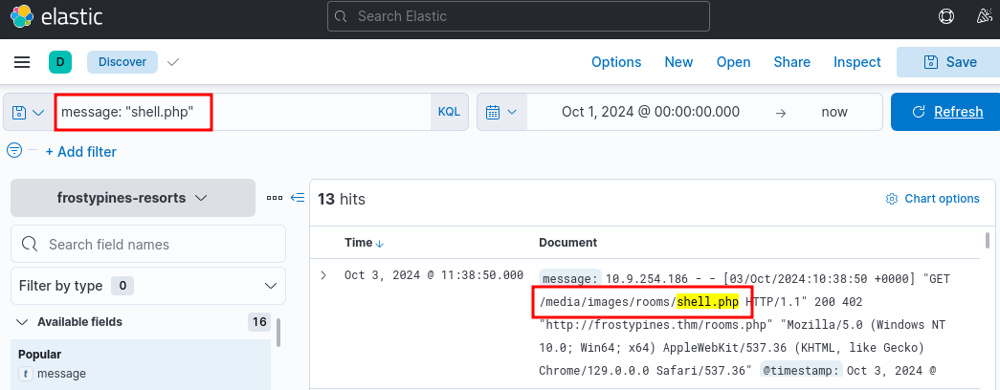
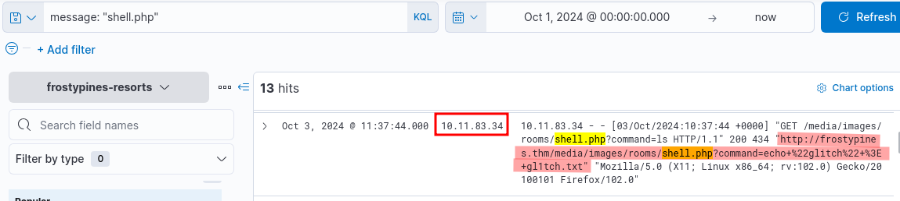
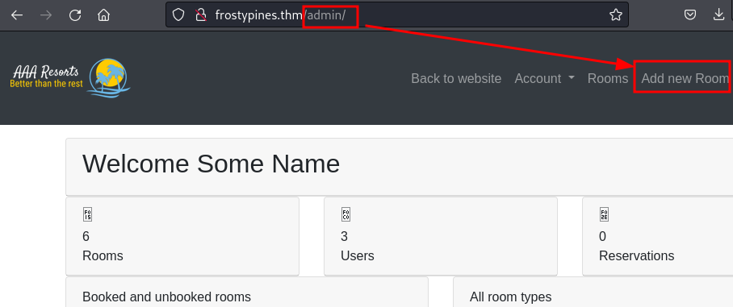
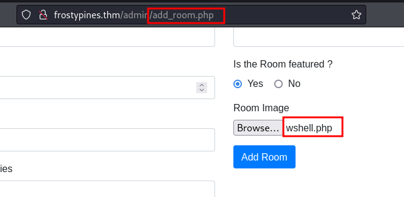
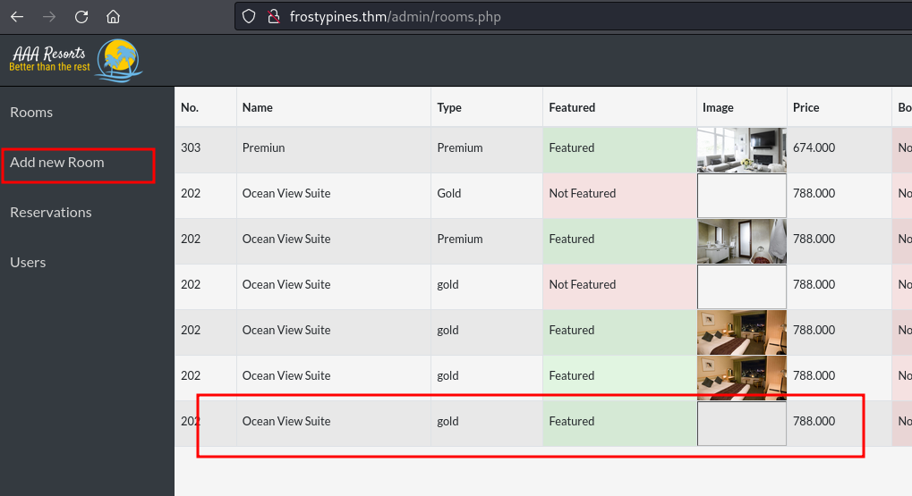
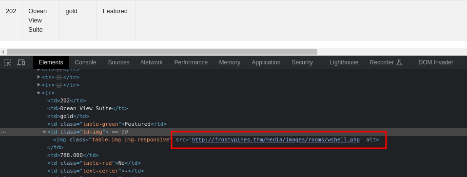
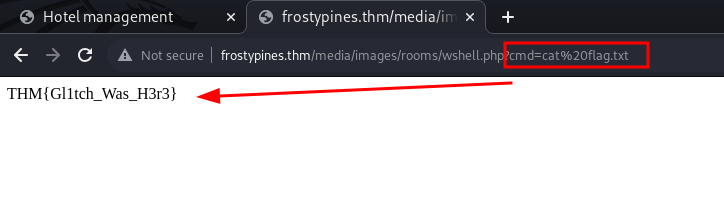

## Learning Objectives

- Learn about Log analysis and tools like ELK.
- Learn about KQL and how it can be used to investigate logs using ELK.
- Learn about RCE (Remote Code Execution), and how this can be done via insecure file upload.

## OPERATION BLUE

In this section of the lesson, we will take a look at what tools and knowledge is required for the blue segment, that is the investigation of the attack itself using tools which enable is to analyse the logs. 

For the first part of Operation Blue, we will demonstrate how to use ELK to analyse the logs of a demonstration web app - WareVille Rails. Feel free to following along for practice. 

## Log Analysis & Introducing ELK

Log analysis is crucial to blue-teaming work, as you have likely discovered through this year's Advent of Cyber.

Analysing logs can quickly become overwhelming, especially if you have multiple devices and services. ELK, or Elasticsearch, Logstash, and Kibana, combines data analytics and processing tools to make analysing logs much more manageable. ELK forms a dedicated stack that can aggregate logs from multiple sources into one central place.

Explaining how ELK collates and processes these logs is out of the scope of today's task. However, if you wish to learn more, you can check out the Investigating with ELK 101 room. For now, it's important to note that multiple processes behind the scenes achieve this.

The first part of today's task is to investigate the attack on Frosty Pines Resort's Hotel Management System to see what it looks like to a blue teamer. You will then test your web app skills by recreating the attack.

## Kibana Query Language (KQL)

KQL, or Kibana Query Language, is an easy-to-use language that can be used to search documents for values. For example, querying if a value within a field exists or matches a value. If you are familiar with Splunk, you may be thinking of SPL (Search Processing Language).

For example, the query to search all documents for an IP address may look like ``ip.address: "10.10.10.10"``. 

Alternatively, Kibana also allows using Lucene query, an advanced language that supports features such as fuzzy terms (searches for terms that are similar to the one provided), regular expressions, etc. For today's task, we will stick with using KQL, which has been enabled by default. The table below contains a mini-cheatsheet for KQL syntax that you may find helpful in today's task.

| **Query/Syntax** | **Description**                                                                                                                                                                               | **Example**                                             |
| ---------------- | --------------------------------------------------------------------------------------------------------------------------------------------------------------------------------------------- | ------------------------------------------------------- |
| " "              | The two quotation marks are used to search for specific values within the documents. Values in quotation marks are used for **exact** searches.                                               | "TryHackMe"                                             |
| *                | The asterisk denotes a wildcard, which searches documents for similar matches to the value provided.                                                                                          | United* (would return United Kingdom and United States) |
| OR               | This logical operator is used to show documents that contain **either** of the values provided.                                                                                               | "United Kingdom" OR "England"                           |
| AND              | This logical operator is used to show documents that contain **both** values.                                                                                                                 | "Ben" AND "25"                                          |
| :                | This is used to search the (specified) field of a document for a value, such as an IP address. Note that the field you provide here will depend on the fields available in the index pattern. | ip.address: 10.10.10.10                                 |

## OPERATION RED

In this section we will now take a look at the red aspect. In other words, the attack itself and how it was carried out.

## Why Do Websites Allow File Uploads

File uploads are everywhere on websites, and for good reason. Users often need to upload files like profile pictures, invoices, or other documents to update their accounts, send receipts, or submit claims. These features make the user experience smoother and more efficient. But while this is convenient, it also creates a risk if file uploads aren't handled properly. If not properly secured, this feature can open up various vulnerabilities attackers can exploit.

## File Upload Vulnerabilities

File upload vulnerabilities occur when a website doesn't properly handle the files that users upload. If the site doesn't check what kind of file is being uploaded, how big it is, or what it contains, it opens the door to all sorts of attacks. For example:

- RCE: Uploading a script that the server runs gives the attacker control over it.
- XSS: Uploading an HTML file that contains an XSS code which will steal a cookie and send it back to the attacker's server.

These can happen if a site doesn't properly secure its file upload functionality.

## Why Unrestricted File Uploads Are Dangerous

Unrestricted file uploads can be particularly dangerous because they allow an attacker to upload any type of file. If the file's contents aren't properly validated to ensure only specific formats like PNG or JPG are accepted, an attacker could upload a malicious script, such as a PHP file or an executable, that the server might process and run. This can lead to code execution on the server, allowing attackers to take over the system.

Examples of abuse through unrestricted file uploads include:

- Uploading a script that the server executes, leading to RCE.
- Uploading a crafted image file that triggers a vulnerability when processed by the server.
- Uploading a web shell and browsing to it directly using a browser.

## Usage of Weak Credentials

One of the easiest ways for attackers to break into systems is through weak or default credentials. This can be an open door for attackers to gain unauthorised access. Default credentials are often found in systems where administrators fail to change initial login details provided during setup. For attackers, trying a few common usernames and passwords can lead to easy access.

## What is Remote Code Execution (RCE)

Remote code execution (RCE) happens when an attacker finds a way to run their own code on a system. This is a highly dangerous vulnerability because it can allow the attacker to take control of the system, exfiltrate sensitive data, or compromise other connected systems.

## What Is a Web Shell

A web shell is a script that attackers upload to a vulnerable server, giving them remote control over it. Once a web shell is in place, attackers can run commands, manipulate files, and essentially use the compromised server as their own. They can even use it to launch attacks on other systems.

For example, attackers could use a web shell to:

- Execute commands on the server
- Move laterally within the network
- Download sensitive data or pivot to other services

A web shell typically gives the attacker a web-based interface to run commands. Still, in some cases, attackers may use a reverse shell to establish a direct connection back to their system, allowing them to control the compromised machine remotely. Once an attacker has this level of access, they might attempt privilege escalation to gain even more control, such as achieving root access or moving deeper into the network.

## Answer the questions below

1. BLUE: Where was the web shell uploaded to?
Answer format: /directory/directory/directory/filename.php

A: **/media/images/rooms/shell.php**

2. BLUE: What IP address accessed the web shell?

A: **10.11.83.34**

3. RED: What is the contents of the flag.txt?

A: **THM{Gl1tch_Was_H3r3}**

